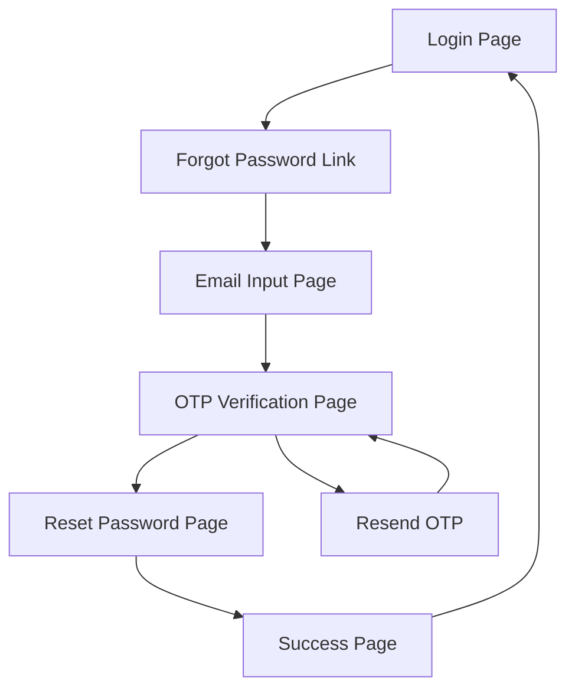

# Forgot Password Feature Requirements

## 1. Product Overview
Implement a secure forgot password system that allows users to reset their passwords via email verification with OTP (One-Time Password) functionality.

## 2. Core Features

### 2.1 User Roles
| Role | Registration Method | Core Permissions |
|------|---------------------|------------------|
| All Users | Email-based | Can request password reset for their own account |
| Admin | System access | Can view password reset logs and statistics |

### 2.2 Feature Module
Our forgot password system consists of the following main pages:
1. **Forgot Password Request Page**: Email input form, validation, submission
2. **OTP Verification Page**: OTP input, verification, resend functionality
3. **Reset Password Page**: New password form, confirmation, security requirements
4. **Success Confirmation Page**: Reset confirmation, login redirect

### 2.3 Page Details
| Page Name | Module Name | Feature description |
|-----------|-------------|---------------------|
| Forgot Password Request | Email Form | Validate email format, check if email exists, send OTP to registered email |
| OTP Verification | OTP Input | Accept 6-digit OTP, validate against server, handle expiration (5 minutes), resend option |
| Reset Password | Password Form | New password input, confirmation field, strength validation, security requirements display |
| Success Confirmation | Confirmation | Display success message, auto-redirect to login after 3 seconds, manual login link |

## 3. Core Process

**User Password Reset Flow:**
1. User enters email on forgot password page
2. System validates email and sends OTP
3. User receives email with 6-digit OTP (5-minute expiry)
4. User enters OTP on verification page
5. Upon successful verification, user sets new password
6. System confirms reset and redirects to login

## 4. User Interface Design

### 4.1 Design Style
- Primary colors: Blue (#3B82F6) and white
- Button style: Rounded corners (8px), solid fill for primary actions
- Font: Inter, 14px for body text, 24px for headings
- Layout style: Centered card-based design with clean spacing
- Icons: Lucide React icons for email, lock, and success states

### 4.2 Page Design Overview
| Page Name | Module Name | UI Elements |
|-----------|-------------|-------------|
| Forgot Password Request | Email Form | Centered card (400px), email input with validation, blue submit button, back to login link |
| OTP Verification | OTP Input | 6 separate input boxes for digits, countdown timer, resend button (disabled during countdown) |
| Reset Password | Password Form | Password input with show/hide toggle, confirmation field, strength indicator, requirements checklist |
| Success Confirmation | Confirmation | Success icon (green checkmark), confirmation message, countdown timer, login button |

### 4.3 Responsiveness
Mobile-first responsive design with breakpoints at 768px and 1024px, touch-optimized input fields and buttons.
