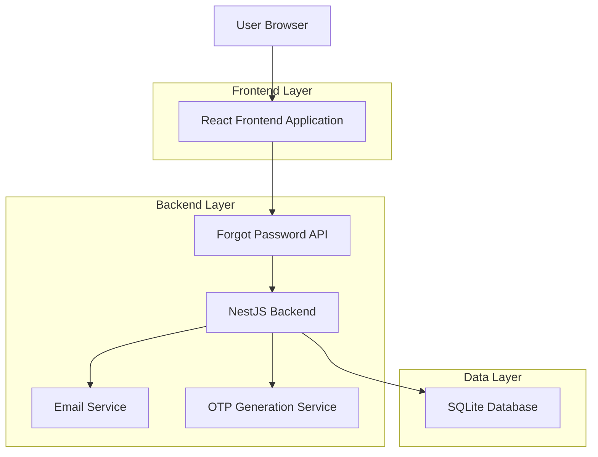
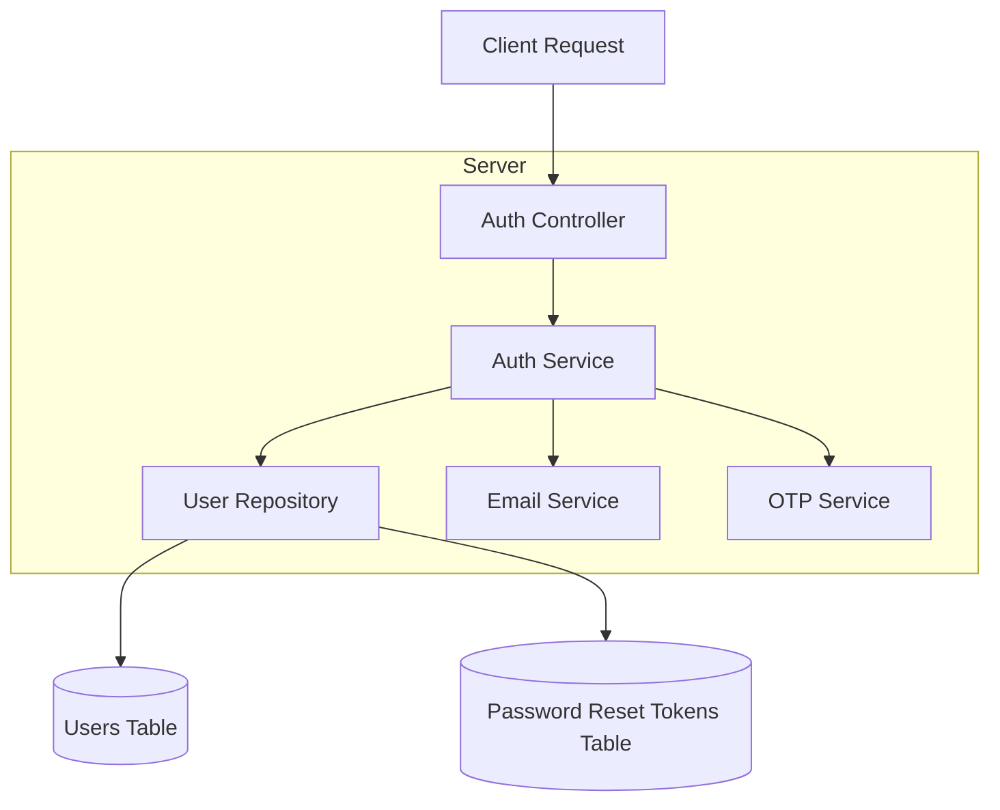
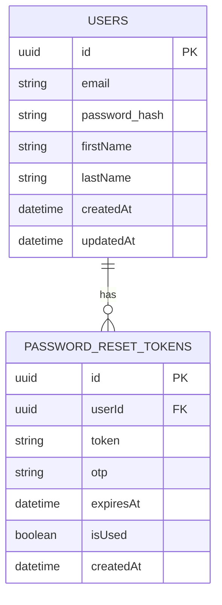

# Forgot Password Technical Architecture

## 1. Architecture Design



## 2. Technology Description

* Frontend: React\@18 + TypeScript + React Router + React Hook Form

* Backend: NestJS + TypeORM + SQLite

* Email Service: Nodemailer with SMTP

* Security: bcrypt for password hashing, crypto for OTP generation

## 3. Route Definitions

| Route            | Purpose                                    |
| ---------------- | ------------------------------------------ |
| /forgot-password | Forgot password request page               |
| /verify-otp      | OTP verification page with token parameter |
| /reset-password  | Password reset page with verified token    |
| /reset-success   | Success confirmation page                  |

## 4. API Definitions

### 4.1 Core API

**Request Password Reset**

```
POST /api/auth/forgot-password
```

Request:

| Param Name | Param Type | isRequired | Description                     |
| ---------- | ---------- | ---------- | ------------------------------- |
| email      | string     | true       | User's registered email address |

Response:

| Param Name | Param Type | Description                                              |
| ---------- | ---------- | -------------------------------------------------------- |
| success    | boolean    | Request status                                           |
| message    | string     | Success/error message                                    |
| resetToken | string     | Temporary token for verification (not exposed to client) |

Example:

```json
{
  "email": "user@example.com"
}
```

**Verify OTP**

```
POST /api/auth/verify-otp
```

Request:

| Param Name | Param Type | isRequired | Description          |
| ---------- | ---------- | ---------- | -------------------- |
| email      | string     | true       | User's email address |
| otp        | string     | true       | 6-digit OTP code     |

Response:

| Param Name | Param Type | Description              |
| ---------- | ---------- | ------------------------ |
| success    | boolean    | Verification status      |
| resetToken | string     | Token for password reset |
| expiresAt  | string     | Token expiration time    |

**Reset Password**

```
POST /api/auth/reset-password
```

Request:

| Param Name  | Param Type | isRequired | Description                |
| ----------- | ---------- | ---------- | -------------------------- |
| resetToken  | string     | true       | Verified reset token       |
| newPassword | string     | true       | New password (min 8 chars) |

Response:

| Param Name | Param Type | Description          |
| ---------- | ---------- | -------------------- |
| success    | boolean    | Reset status         |
| message    | string     | Confirmation message |

**Resend OTP**

```
POST /api/auth/resend-otp
```

Request:

| Param Name | Param Type | isRequired | Description          |
| ---------- | ---------- | ---------- | -------------------- |
| email      | string     | true       | User's email address |

## 5. Server Architecture Diagram



## 6. Data Model

### 6.1 Data Model Definition



### 6.2 Data Definition Language

**Password Reset Tokens Table**

```sql
-- Create table
CREATE TABLE password_reset_tokens (
    id UUID PRIMARY KEY DEFAULT gen_random_uuid(),
    user_id UUID NOT NULL,
    token VARCHAR(255) NOT NULL UNIQUE,
    otp VARCHAR(6) NOT NULL,
    expires_at TIMESTAMP WITH TIME ZONE NOT NULL,
    is_used BOOLEAN DEFAULT FALSE,
    created_at TIMESTAMP WITH TIME ZONE DEFAULT NOW(),
    FOREIGN KEY (user_id) REFERENCES users(id) ON DELETE CASCADE
);

-- Create indexes
CREATE INDEX idx_password_reset_tokens_user_id ON password_reset_tokens(user_id);
CREATE INDEX idx_password_reset_tokens_token ON password_reset_tokens(token);
CREATE INDEX idx_password_reset_tokens_expires_at ON password_reset_tokens(expires_at);

-- Add email configuration to environment
-- SMTP_HOST=smtp.gmail.com
-- SMTP_PORT=587
-- SMTP_USER=your-email@gmail.com
-- SMTP_PASS=your-app-password
-- FROM_EMAIL=noreply@taxipark.com
```

**Security Considerations:**

* OTP expires after 5 minutes

* Reset tokens expire after 1 hour

* Rate limiting: 3 requests per 15 minutes per IP

* OTP is 6 digits, cryptographically secure

* Tokens are hashed before storage

* Email validation prevents enumeration attacks

