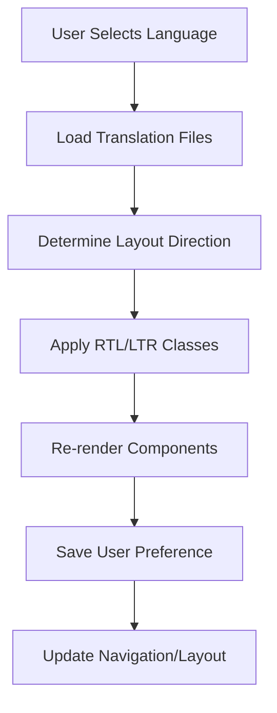

# Internationalization (i18n) with RTL/LTR Support Requirements

## 1. Product Overview
Implement a comprehensive internationalization system supporting multiple languages with automatic RTL (Right-to-Left) and LTR (Left-to-Right) layout switching based on language selection.

## 2. Core Features

### 2.1 User Roles
| Role | Registration Method | Core Permissions |
|------|---------------------|------------------|
| All Users | Any registration | Can change language preference, automatic layout adaptation |
| Admin | System access | Can manage translations, add new languages, view usage statistics |

### 2.2 Feature Module
Our i18n system consists of the following main components:
1. **Language Selector**: Dropdown/modal for language selection, flag icons, current language display
2. **Translation Management**: Dynamic text loading, fallback handling, pluralization support
3. **Layout Direction**: Automatic RTL/LTR switching, mirrored components, text alignment
4. **Date/Number Formatting**: Locale-specific formatting, currency display, time zones

### 2.3 Component Details
| Component Name | Module Name | Feature description |
|----------------|-------------|---------------------|
| Language Selector | Language Switcher | Dropdown with flag icons, language names in native script, persistent selection |
| Translation Provider | i18n Context | Load translations, handle missing keys, provide translation functions |
| Layout Direction | RTL/LTR Handler | Detect language direction, apply CSS classes, mirror layouts automatically |
| Formatted Components | Locale Formatters | Date picker, number inputs, currency display with locale-specific formatting |

## 3. Core Process

**Language Selection Flow:**
1. User selects language from dropdown
2. System loads translation files
3. Layout direction is determined (RTL/LTR)
4. All components re-render with new language
5. Preference is saved to localStorage/user profile
6. Page layout adjusts automatically

## 4. User Interface Design

### 4.1 Design Style
- Primary colors: Adaptive to current theme
- Button style: Consistent with existing design system
- Font: Support for Arabic (Noto Sans Arabic), Hebrew (Noto Sans Hebrew), Latin scripts
- Layout style: Flexible grid system that adapts to text direction
- Icons: Directional icons that flip for RTL (arrows, chevrons)

### 4.2 Supported Languages
| Language | Code | Direction | Script | Priority |
|----------|------|-----------|--------|---------|
| English | en | LTR | Latin | High |
| Arabic | ar | RTL | Arabic | High |
| Hebrew | he | RTL | Hebrew | Medium |
| French | fr | LTR | Latin | Medium |
| Spanish | es | LTR | Latin | Medium |
| German | de | LTR | Latin | Low |

### 4.3 Layout Adaptations
| Component Type | LTR Behavior | RTL Behavior |
|----------------|--------------|-------------|
| Navigation Menu | Left-aligned, left-to-right flow | Right-aligned, right-to-left flow |
| Sidebar | Left side placement | Right side placement |
| Form Labels | Left-aligned | Right-aligned |
| Icons | Standard orientation | Horizontally flipped for directional icons |
| Text Alignment | Left-aligned | Right-aligned |
| Margins/Padding | margin-left, padding-right | margin-right, padding-left |

### 4.4 Responsiveness
Fully responsive design that maintains RTL/LTR behavior across all screen sizes, with touch-optimized language selector for mobile devices.
