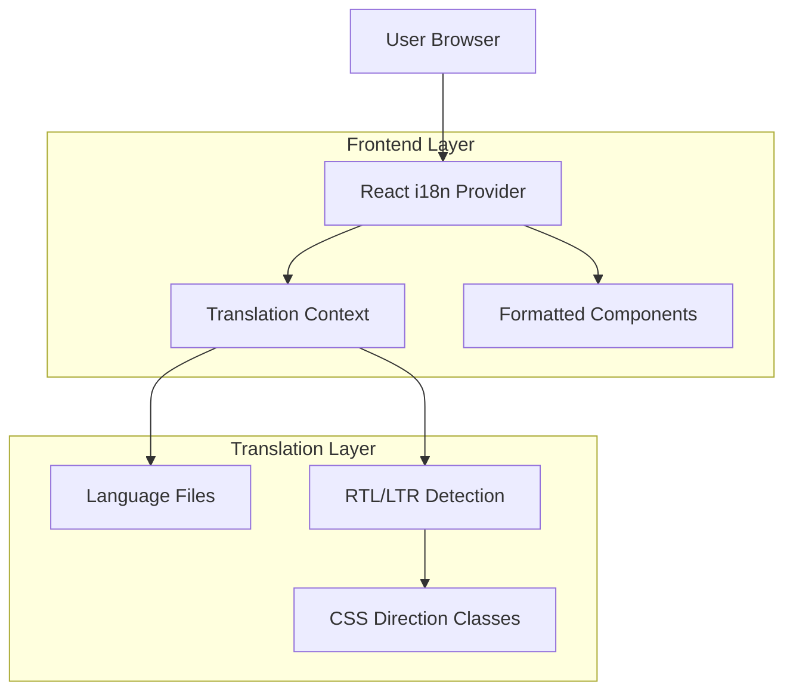

# Internationalization (i18n) Technical Architecture

## 1. Architecture Design



## 2. Technology Description
- Frontend: React@18 + react-i18next + i18next
- RTL Support: CSS logical properties + Tailwind CSS RTL plugin
- Date/Number: Intl API + date-fns with locale support
- Storage: localStorage for language preference
- Fonts: Google Fonts (Noto Sans family for multi-script support)

## 3. File Structure
```
src/
├── i18n/
│   ├── index.ts                 # i18next configuration
│   ├── resources/
│   │   ├── en/
│   │   │   ├── common.json       # Common translations
│   │   │   ├── navigation.json   # Navigation items
│   │   │   ├── forms.json        # Form labels/validation
│   │   │   └── pages.json        # Page-specific content
│   │   ├── ar/
│   │   │   ├── common.json
│   │   │   ├── navigation.json
│   │   │   ├── forms.json
│   │   │   └── pages.json
│   │   └── he/
│   │       ├── common.json
│   │       ├── navigation.json
│   │       ├── forms.json
│   │       └── pages.json
│   └── utils/
│       ├── rtl-detection.ts      # RTL language detection
│       ├── direction-provider.ts # Direction context
│       └── formatters.ts         # Locale-specific formatters
├── components/
│   ├── LanguageSelector.tsx      # Language switcher component
│   ├── DirectionProvider.tsx     # RTL/LTR wrapper
│   └── FormattedComponents/      # Locale-aware components
└── hooks/
    ├── useDirection.ts           # Direction hook
    ├── useTranslation.ts         # Enhanced translation hook
    └── useLocaleFormat.ts        # Formatting hook
```

## 4. Implementation Strategy

### 4.1 Core i18n Setup

**i18next Configuration**
```typescript
// src/i18n/index.ts
import i18n from 'i18next';
import { initReactI18next } from 'react-i18next';
import Backend from 'i18next-http-backend';
import LanguageDetector from 'i18next-browser-languagedetector';

// Language resources
import enCommon from './resources/en/common.json';
import arCommon from './resources/ar/common.json';
import heCommon from './resources/he/common.json';

const resources = {
  en: { common: enCommon, /* other namespaces */ },
  ar: { common: arCommon, /* other namespaces */ },
  he: { common: heCommon, /* other namespaces */ }
};

i18n
  .use(Backend)
  .use(LanguageDetector)
  .use(initReactI18next)
  .init({
    resources,
    fallbackLng: 'en',
    debug: process.env.NODE_ENV === 'development',
    interpolation: {
      escapeValue: false
    },
    detection: {
      order: ['localStorage', 'navigator', 'htmlTag'],
      caches: ['localStorage']
    }
  });

export default i18n;
```

### 4.2 RTL/LTR Direction Management

**Direction Detection Utility**
```typescript
// src/i18n/utils/rtl-detection.ts
const RTL_LANGUAGES = ['ar', 'he', 'fa', 'ur'];

export const isRTL = (language: string): boolean => {
  return RTL_LANGUAGES.includes(language.split('-')[0]);
};

export const getDirection = (language: string): 'rtl' | 'ltr' => {
  return isRTL(language) ? 'rtl' : 'ltr';
};
```

**Direction Provider Component**
```typescript
// src/components/DirectionProvider.tsx
import React, { createContext, useContext, useEffect } from 'react';
import { useTranslation } from 'react-i18next';
import { getDirection } from '../i18n/utils/rtl-detection';

interface DirectionContextType {
  direction: 'rtl' | 'ltr';
  isRTL: boolean;
}

const DirectionContext = createContext<DirectionContextType | undefined>(undefined);

export const useDirection = () => {
  const context = useContext(DirectionContext);
  if (!context) {
    throw new Error('useDirection must be used within DirectionProvider');
  }
  return context;
};

export const DirectionProvider: React.FC<{ children: React.ReactNode }> = ({ children }) => {
  const { i18n } = useTranslation();
  const direction = getDirection(i18n.language);
  const isRTL = direction === 'rtl';

  useEffect(() => {
    document.documentElement.dir = direction;
    document.documentElement.lang = i18n.language;
  }, [direction, i18n.language]);

  return (
    <DirectionContext.Provider value={{ direction, isRTL }}>
      <div className={`${direction} ${isRTL ? 'rtl' : 'ltr'}`}>
        {children}
      </div>
    </DirectionContext.Provider>
  );
};
```

### 4.3 Language Selector Component

```typescript
// src/components/LanguageSelector.tsx
import React, { useState } from 'react';
import { useTranslation } from 'react-i18next';
import { ChevronDown, Globe } from 'lucide-react';

const LANGUAGES = [
  { code: 'en', name: 'English', nativeName: 'English', flag: '🇺🇸' },
  { code: 'ar', name: 'Arabic', nativeName: 'العربية', flag: '🇸🇦' },
  { code: 'he', name: 'Hebrew', nativeName: 'עברית', flag: '🇮🇱' },
  { code: 'fr', name: 'French', nativeName: 'Français', flag: '🇫🇷' },
  { code: 'es', name: 'Spanish', nativeName: 'Español', flag: '🇪🇸' }
];

export const LanguageSelector: React.FC = () => {
  const { i18n, t } = useTranslation();
  const [isOpen, setIsOpen] = useState(false);
  
  const currentLanguage = LANGUAGES.find(lang => lang.code === i18n.language) || LANGUAGES[0];

  const handleLanguageChange = (languageCode: string) => {
    i18n.changeLanguage(languageCode);
    setIsOpen(false);
  };

  return (
    <div className="relative">
      <button
        onClick={() => setIsOpen(!isOpen)}
        className="flex items-center space-x-2 px-3 py-2 rounded-md hover:bg-gray-100 transition-colors"
      >
        <Globe className="h-4 w-4" />
        <span className="text-sm font-medium">{currentLanguage.flag} {currentLanguage.nativeName}</span>
        <ChevronDown className="h-4 w-4" />
      </button>
      
      {isOpen && (
        <div className="absolute top-full mt-1 w-48 bg-white border border-gray-200 rounded-md shadow-lg z-50">
          {LANGUAGES.map((language) => (
            <button
              key={language.code}
              onClick={() => handleLanguageChange(language.code)}
              className="w-full text-left px-4 py-2 hover:bg-gray-50 flex items-center space-x-3"
            >
              <span className="text-lg">{language.flag}</span>
              <div>
                <div className="font-medium">{language.nativeName}</div>
                <div className="text-sm text-gray-500">{language.name}</div>
              </div>
            </button>
          ))}
        </div>
      )}
    </div>
  );
};
```

## 5. CSS and Styling Strategy

### 5.1 Tailwind CSS RTL Configuration

```javascript
// tailwind.config.js
module.exports = {
  content: ['./src/**/*.{js,jsx,ts,tsx}'],
  theme: {
    extend: {
      fontFamily: {
        'arabic': ['Noto Sans Arabic', 'sans-serif'],
        'hebrew': ['Noto Sans Hebrew', 'sans-serif'],
        'latin': ['Inter', 'sans-serif']
      }
    }
  },
  plugins: [
    require('@tailwindcss/forms'),
    require('tailwindcss-rtl')
  ]
};
```

### 5.2 RTL-Aware CSS Classes

```css
/* src/styles/rtl.css */
.rtl {
  direction: rtl;
}

.ltr {
  direction: ltr;
}

/* Directional margins and padding */
.ms-4 { margin-inline-start: 1rem; }
.me-4 { margin-inline-end: 1rem; }
.ps-4 { padding-inline-start: 1rem; }
.pe-4 { padding-inline-end: 1rem; }

/* Text alignment */
.text-start { text-align: start; }
.text-end { text-align: end; }

/* RTL-specific overrides */
.rtl .transform-flip {
  transform: scaleX(-1);
}

/* Font families based on language */
.rtl[lang="ar"] {
  font-family: 'Noto Sans Arabic', sans-serif;
}

.rtl[lang="he"] {
  font-family: 'Noto Sans Hebrew', sans-serif;
}

.ltr {
  font-family: 'Inter', sans-serif;
}
```

## 6. Translation File Structure

### 6.1 English Common Translations
```json
// src/i18n/resources/en/common.json
{
  "buttons": {
    "save": "Save",
    "cancel": "Cancel",
    "delete": "Delete",
    "edit": "Edit",
    "add": "Add",
    "search": "Search"
  },
  "navigation": {
    "dashboard": "Dashboard",
    "users": "Users",
    "settings": "Settings",
    "reports": "Reports"
  },
  "messages": {
    "success": "Operation completed successfully",
    "error": "An error occurred",
    "loading": "Loading...",
    "noData": "No data available"
  }
}
```

### 6.2 Arabic Common Translations
```json
// src/i18n/resources/ar/common.json
{
  "buttons": {
    "save": "حفظ",
    "cancel": "إلغاء",
    "delete": "حذف",
    "edit": "تعديل",
    "add": "إضافة",
    "search": "بحث"
  },
  "navigation": {
    "dashboard": "لوحة التحكم",
    "users": "المستخدمون",
    "settings": "الإعدادات",
    "reports": "التقارير"
  },
  "messages": {
    "success": "تمت العملية بنجاح",
    "error": "حدث خطأ",
    "loading": "جاري التحميل...",
    "noData": "لا توجد بيانات متاحة"
  }
}
```

## 7. Performance Considerations

- **Lazy Loading**: Load translation files on demand
- **Caching**: Cache translations in localStorage
- **Bundle Splitting**: Separate translation files by language
- **Font Loading**: Optimize web font loading for different scripts
- **Direction Detection**: Minimize layout shifts during direction changes
