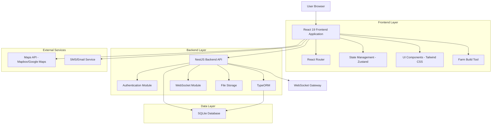
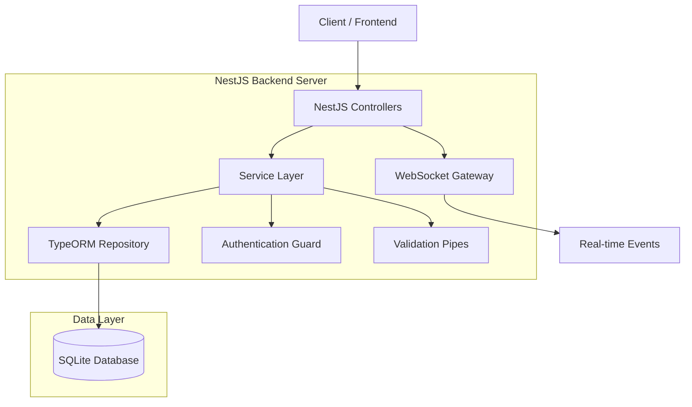
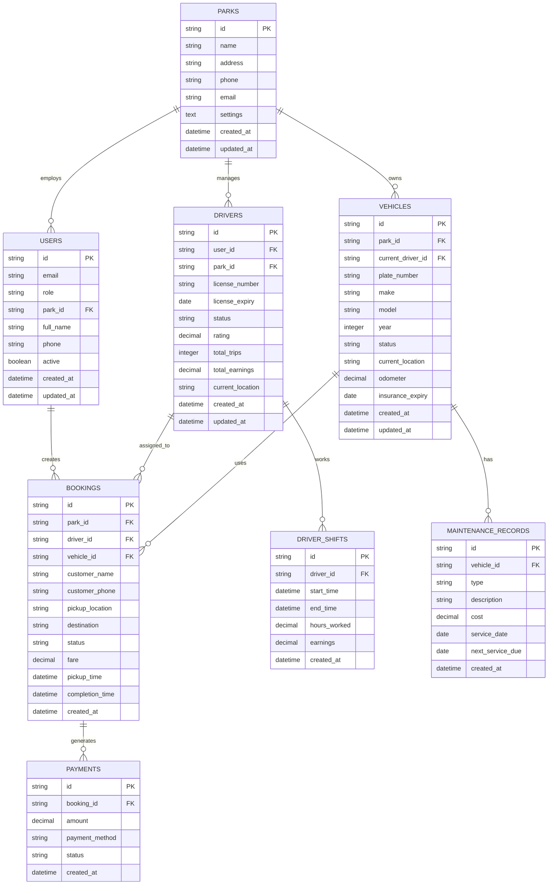

# Taxi Parks Dashboard - Technical Architecture Document

## 1. Architecture Design



## 7. Testing Strategy

### 7.1 Frontend Testing (React 19 + Jest + React Testing Library)

**Unit Testing Setup**

```typescript
// jest.config.js
module.exports = {
  testEnvironment: 'jsdom',
  setupFilesAfterEnv: ['<rootDir>/src/test/setup.ts'],
  moduleNameMapping: {
    '^@/(.*)$': '<rootDir>/src/$1',
    '\\.(css|less|scss|sass)$': 'identity-obj-proxy'
  },
  transform: {
    '^.+\\.(ts|tsx)$': 'ts-jest'
  },
  collectCoverageFrom: [
    'src/**/*.{ts,tsx}',
    '!src/**/*.d.ts',
    '!src/test/**/*'
  ]
};

// src/test/setup.ts
import '@testing-library/jest-dom';
import { server } from './mocks/server';

beforeAll(() => server.listen());
afterEach(() => server.resetHandlers());
afterAll(() => server.close());
```

**Component Testing Examples**

```typescript
// Dashboard.test.tsx
import { render, screen, waitFor } from '@testing-library/react';
import userEvent from '@testing-library/user-event';
import { QueryClient, QueryClientProvider } from '@tanstack/react-query';
import Dashboard from '../Dashboard';

describe('Dashboard Component', () => {
  const renderWithProviders = (component: React.ReactElement) => {
    const queryClient = new QueryClient({
      defaultOptions: { queries: { retry: false } }
    });
    return render(
      <QueryClientProvider client={queryClient}>
        {component}
      </QueryClientProvider>
    );
  };

  test('displays overview metrics correctly', async () => {
    renderWithProviders(<Dashboard />);
    
    await waitFor(() => {
      expect(screen.getByText('Active Vehicles')).toBeInTheDocument();
      expect(screen.getByText('Available Drivers')).toBeInTheDocument();
      expect(screen.getByText('Daily Revenue')).toBeInTheDocument();
    });
  });

  test('handles real-time updates', async () => {
    const user = userEvent.setup();
    renderWithProviders(<Dashboard />);
    
    // Test WebSocket connection and updates
    // Mock WebSocket events and verify UI updates
  });
});
```

**Custom Hooks Testing**

```typescript
// useVehicles.test.ts
import { renderHook, waitFor } from '@testing-library/react';
import { QueryClient, QueryClientProvider } from '@tanstack/react-query';
import { useVehicles } from '../hooks/useVehicles';

describe('useVehicles Hook', () => {
  test('fetches vehicles data successfully', async () => {
    const queryClient = new QueryClient();
    const wrapper = ({ children }: { children: React.ReactNode }) => (
      <QueryClientProvider client={queryClient}>{children}</QueryClientProvider>
    );

    const { result } = renderHook(() => useVehicles('park-id'), { wrapper });

    await waitFor(() => {
      expect(result.current.isSuccess).toBe(true);
      expect(result.current.data).toHaveLength(5);
    });
  });
});
```

### 7.2 Backend Testing (NestJS + Jest)

**Unit Testing Setup**

```typescript
// test/jest-e2e.json
{
  "moduleFileExtensions": ["js", "json", "ts"],
  "rootDir": ".",
  "testEnvironment": "node",
  "testRegex": ".e2e-spec.ts$",
  "transform": {
    "^.+\\.(t|j)s$": "ts-jest"
  },
  "collectCoverageFrom": [
    "src/**/*.(t|j)s",
    "!src/**/*.spec.ts",
    "!src/**/*.e2e-spec.ts"
  ]
}
```

**Service Testing**

```typescript
// vehicle.service.spec.ts
import { Test, TestingModule } from '@nestjs/testing';
import { getRepositoryToken } from '@nestjs/typeorm';
import { Repository } from 'typeorm';
import { VehicleService } from './vehicle.service';
import { Vehicle } from './entities/vehicle.entity';

describe('VehicleService', () => {
  let service: VehicleService;
  let repository: Repository<Vehicle>;

  const mockRepository = {
    find: jest.fn(),
    findOne: jest.fn(),
    save: jest.fn(),
    update: jest.fn(),
    delete: jest.fn(),
  };

  beforeEach(async () => {
    const module: TestingModule = await Test.createTestingModule({
      providers: [
        VehicleService,
        {
          provide: getRepositoryToken(Vehicle),
          useValue: mockRepository,
        },
      ],
    }).compile();

    service = module.get<VehicleService>(VehicleService);
    repository = module.get<Repository<Vehicle>>(getRepositoryToken(Vehicle));
  });

  describe('findAll', () => {
    test('should return array of vehicles', async () => {
      const vehicles = [{ id: '1', plate_number: 'ABC123' }];
      mockRepository.find.mockResolvedValue(vehicles);

      const result = await service.findAll('park-id');
      expect(result).toEqual(vehicles);
      expect(repository.find).toHaveBeenCalledWith({
        where: { park_id: 'park-id' },
        relations: ['current_driver']
      });
    });
  });
});
```

**Controller Testing**

```typescript
// vehicle.controller.spec.ts
import { Test, TestingModule } from '@nestjs/testing';
import { VehicleController } from './vehicle.controller';
import { VehicleService } from './vehicle.service';
import { JwtAuthGuard } from '../auth/jwt-auth.guard';

describe('VehicleController', () => {
  let controller: VehicleController;
  let service: VehicleService;

  const mockVehicleService = {
    findAll: jest.fn(),
    findOne: jest.fn(),
    update: jest.fn(),
    create: jest.fn(),
  };

  beforeEach(async () => {
    const module: TestingModule = await Test.createTestingModule({
      controllers: [VehicleController],
      providers: [
        {
          provide: VehicleService,
          useValue: mockVehicleService,
        },
      ],
    })
    .overrideGuard(JwtAuthGuard)
    .useValue({ canActivate: () => true })
    .compile();

    controller = module.get<VehicleController>(VehicleController);
    service = module.get<VehicleService>(VehicleService);
  });

  test('should get all vehicles', async () => {
    const vehicles = [{ id: '1', plate_number: 'ABC123' }];
    mockVehicleService.findAll.mockResolvedValue(vehicles);

    const result = await controller.findAll('park-id');
    expect(result).toEqual(vehicles);
  });
});
```

**E2E Testing**

```typescript
// vehicle.e2e-spec.ts
import { Test, TestingModule } from '@nestjs/testing';
import { INestApplication } from '@nestjs/common';
import * as request from 'supertest';
import { AppModule } from '../src/app.module';
import { getRepositoryToken } from '@nestjs/typeorm';
import { Vehicle } from '../src/vehicle/entities/vehicle.entity';

describe('VehicleController (e2e)', () => {
  let app: INestApplication;
  let vehicleRepository: any;

  beforeEach(async () => {
    const moduleFixture: TestingModule = await Test.createTestingModule({
      imports: [AppModule],
    }).compile();

    app = moduleFixture.createNestApplication();
    vehicleRepository = moduleFixture.get(getRepositoryToken(Vehicle));
    await app.init();
  });

  test('/vehicles (GET)', () => {
    return request(app.getHttpServer())
      .get('/vehicles?park_id=test-park')
      .set('Authorization', 'Bearer valid-jwt-token')
      .expect(200)
      .expect((res) => {
        expect(Array.isArray(res.body)).toBe(true);
      });
  });

  test('/vehicles/:id (PATCH)', () => {
    return request(app.getHttpServer())
      .patch('/vehicles/test-vehicle-id')
      .set('Authorization', 'Bearer valid-jwt-token')
      .send({ status: 'maintenance' })
      .expect(200);
  });

  afterAll(async () => {
    await app.close();
  });
});
```

### 7.3 Integration Testing

**WebSocket Testing**

```typescript
// websocket.e2e-spec.ts
import { Test } from '@nestjs/testing';
import { INestApplication } from '@nestjs/common';
import { WsAdapter } from '@nestjs/platform-ws';
import * as WebSocket from 'ws';
import { AppModule } from '../src/app.module';

describe('WebSocket Gateway (e2e)', () => {
  let app: INestApplication;
  let ws: WebSocket;

  beforeEach(async () => {
    const moduleFixture = await Test.createTestingModule({
      imports: [AppModule],
    }).compile();

    app = moduleFixture.createNestApplication();
    app.useWebSocketAdapter(new WsAdapter(app));
    await app.listen(3001);

    ws = new WebSocket('ws://localhost:3001/ws/vehicles');
  });

  test('should receive vehicle location updates', (done) => {
    ws.on('message', (data) => {
      const message = JSON.parse(data.toString());
      expect(message.event).toBe('vehicle-location-update');
      expect(message.data).toHaveProperty('vehicleId');
      expect(message.data).toHaveProperty('location');
      done();
    });

    // Trigger location update
    ws.send(JSON.stringify({
      event: 'update-location',
      data: { vehicleId: 'test-id', location: { lat: 40.7128, lng: -74.0060 } }
    }));
  });

  afterEach(async () => {
    ws.close();
    await app.close();
  });
});
```

### 7.4 Test Coverage and CI/CD

**Package.json Scripts**

```json
{
  "scripts": {
    "test": "jest",
    "test:watch": "jest --watch",
    "test:coverage": "jest --coverage",
    "test:e2e": "jest --config ./test/jest-e2e.json",
    "test:frontend": "cd frontend && npm run test",
    "test:backend": "cd backend && npm run test",
    "test:all": "npm run test:frontend && npm run test:backend && npm run test:e2e"
  }
}
```

**GitHub Actions Workflow**

```yaml
# .github/workflows/test.yml
name: Test Suite

on: [push, pull_request]

jobs:
  test:
    runs-on: ubuntu-latest
    
    steps:
    - uses: actions/checkout@v3
    
    - name: Setup Node.js
      uses: actions/setup-node@v3
      with:
        node-version: '20'
        cache: 'npm'
    
    - name: Install dependencies
      run: |
        npm ci
        cd frontend && npm ci
        cd ../backend && npm ci
    
    - name: Run frontend tests
      run: cd frontend && npm run test:coverage
    
    - name: Run backend tests
      run: cd backend && npm run test:coverage
    
    - name: Run E2E tests
      run: npm run test:e2e
    
    - name: Upload coverage reports
      uses: codecov/codecov-action@v3
```

## 2. Technology Description

* **Frontend**: React\@19 + TypeScript + Farm + Tailwind CSS\@3

* **Build Tool**: Farm (fast Rust-based build tool replacing Vite)

* **State Management**: Zustand for client state, React Query for server state

* **Backend**: NestJS + TypeORM + SQLite

* **Database**: SQLite with TypeORM

* **Real-time**: WebSocket Gateway (NestJS)

* **Authentication**: JWT with NestJS Guards

* **Maps**: Mapbox GL JS or Google Maps API

* **Charts**: Chart.js or Recharts for analytics visualization

* **UI Components**: Headless UI + Tailwind CSS for custom components

* **Testing**: Jest + React Testing Library + NestJS Testing utilities

## 3. Route Definitions

| Route        | Purpose                                                   |
| ------------ | --------------------------------------------------------- |
| /            | Dashboard home with overview metrics and real-time status |
| /login       | Authentication page for all user types                    |
| /fleet       | Fleet management interface for vehicles and maintenance   |
| /drivers     | Driver management with profiles and performance tracking  |
| /bookings    | Booking system for trip management and assignments        |
| /analytics   | Analytics dashboard with reports and data visualization   |
| /settings    | System configuration and user management                  |
| /profile     | User profile management and preferences                   |
| /vehicle/:id | Individual vehicle details and history                    |
| /driver/:id  | Individual driver profile and performance metrics         |
| /trip/:id    | Trip details and tracking interface                       |

## 4. API Definitions

### 4.1 Core API (NestJS Backend)

**Authentication**

```typescript
// User login
POST /api/auth/login
Request: {
  email: string;
  password: string;
}
Response: {
  access_token: string;
  user: UserDto;
}

// User registration
POST /api/auth/register
Request: {
  email: string;
  password: string;
  role: 'driver' | 'dispatcher' | 'manager' | 'admin';
  park_id: string;
  full_name: string;
}
Response: {
  access_token: string;
  user: UserDto;
}
```

**Vehicle Management**

```typescript
// Get all vehicles
GET /api/vehicles?park_id={parkId}
Response: Vehicle[]

// Update vehicle status
PATCH /api/vehicles/{vehicleId}
Request: {
  status: 'available' | 'busy' | 'maintenance';
  current_location?: { lat: number; lng: number };
}
Response: Vehicle

// Get vehicle details
GET /api/vehicles/{vehicleId}
Response: Vehicle & { driver?: Driver }
```

**Real-time WebSocket Events**

```typescript
// Subscribe to vehicle location updates
WebSocket: /ws/vehicles
Events:
- 'vehicle-location-update': { vehicleId: string, location: Point }
- 'vehicle-status-change': { vehicleId: string, status: string }
- 'booking-assigned': { bookingId: string, driverId: string }

// Client subscription
socket.on('vehicle-location-update', (data) => {
  // Handle real-time location update
});
```

## 5. Server Architecture Diagram



## 6. Data Model

### 6.1 Data Model Definition (SQLite with TypeORM)



### 6.2 TypeORM Entity Definitions (SQLite)

**Park Entity**

```typescript
@Entity('parks')
export class Park {
  @PrimaryGeneratedColumn('uuid')
  id: string;

  @Column({ type: 'varchar', length: 255 })
  name: string;

  @Column({ type: 'text', nullable: true })
  address: string;

  @Column({ type: 'varchar', length: 20, nullable: true })
  phone: string;

  @Column({ type: 'varchar', length: 255, nullable: true })
  email: string;

  @Column({ type: 'text', default: '{}' })
  settings: string;

  @CreateDateColumn()
  created_at: Date;

  @UpdateDateColumn()
  updated_at: Date;

  @OneToMany(() => User, user => user.park)
  users: User[];

  @OneToMany(() => Vehicle, vehicle => vehicle.park)
  vehicles: Vehicle[];

  @OneToMany(() => Driver, driver => driver.park)
  drivers: Driver[];
}
```

**User Entity**

```typescript
@Entity('users')
export class User {
  @PrimaryGeneratedColumn('uuid')
  id: string;

  @Column({ type: 'varchar', length: 255, unique: true })
  email: string;

  @Column({ type: 'varchar', length: 255 })
  password_hash: string;

  @Column({ type: 'varchar', length: 20 })
  role: 'admin' | 'manager' | 'dispatcher' | 'driver';

  @Column({ type: 'uuid' })
  park_id: string;

  @Column({ type: 'varchar', length: 255 })
  full_name: string;

  @Column({ type: 'varchar', length: 20, nullable: true })
  phone: string;

  @Column({ type: 'boolean', default: true })
  active: boolean;

  @CreateDateColumn()
  created_at: Date;

  @UpdateDateColumn()
  updated_at: Date;

  @ManyToOne(() => Park, park => park.users)
  @JoinColumn({ name: 'park_id' })
  park: Park;

  @OneToOne(() => Driver, driver => driver.user)
  driver: Driver;
}
```

**Driver Entity**

```typescript
@Entity('drivers')
export class Driver {
  @PrimaryGeneratedColumn('uuid')
  id: string;

  @Column({ type: 'uuid' })
  user_id: string;

  @Column({ type: 'uuid' })
  park_id: string;

  @Column({ type: 'varchar', length: 50, unique: true })
  license_number: string;

  @Column({ type: 'date' })
  license_expiry: Date;

  @Column({ type: 'varchar', length: 20, default: 'offline' })
  status: 'online' | 'offline' | 'busy' | 'break';

  @Column({ type: 'decimal', precision: 3, scale: 2, default: 5.00 })
  rating: number;

  @Column({ type: 'integer', default: 0 })
  total_trips: number;

  @Column({ type: 'decimal', precision: 10, scale: 2, default: 0.00 })
  total_earnings: number;

  @Column({ type: 'text', nullable: true })
  current_location: string; // JSON string: {lat: number, lng: number}

  @CreateDateColumn()
  created_at: Date;

  @UpdateDateColumn()
  updated_at: Date;

  @OneToOne(() => User, user => user.driver)
  @JoinColumn({ name: 'user_id' })
  user: User;

  @ManyToOne(() => Park, park => park.drivers)
  @JoinColumn({ name: 'park_id' })
  park: Park;

  @OneToMany(() => Booking, booking => booking.driver)
  bookings: Booking[];
}
```

**Vehicle Entity**

```typescript
@Entity('vehicles')
export class Vehicle {
  @PrimaryGeneratedColumn('uuid')
  id: string;

  @Column({ type: 'uuid' })
  park_id: string;

  @Column({ type: 'uuid', nullable: true })
  current_driver_id: string;

  @Column({ type: 'varchar', length: 20, unique: true })
  plate_number: string;

  @Column({ type: 'varchar', length: 50 })
  make: string;

  @Column({ type: 'varchar', length: 50 })
  model: string;

  @Column({ type: 'integer' })
  year: number;

  @Column({ type: 'varchar', length: 20, default: 'available' })
  status: 'available' | 'busy' | 'maintenance' | 'inactive';

  @Column({ type: 'text', nullable: true })
  current_location: string; // JSON string: {lat: number, lng: number}

  @Column({ type: 'decimal', precision: 10, scale: 2, default: 0.00 })
  odometer: number;

  @Column({ type: 'date' })
  insurance_expiry: Date;

  @CreateDateColumn()
  created_at: Date;

  @UpdateDateColumn()
  updated_at: Date;

  @ManyToOne(() => Park, park => park.vehicles)
  @JoinColumn({ name: 'park_id' })
  park: Park;

  @ManyToOne(() => Driver, driver => driver.id)
  @JoinColumn({ name: 'current_driver_id' })
  current_driver: Driver;

  @OneToMany(() => Booking, booking => booking.vehicle)
  bookings: Booking[];
}
```

**Initial Data Seeding**

```typescript
// Database seeding service
export class DatabaseSeeder {
  async seed() {
    // Create sample park
    const park = await this.parkRepository.save({
      name: 'Metro Taxi Park',
      address: '123 Main Street, City Center',
      phone: '+1234567890',
      email: 'info@metrotaxi.com'
    });

    // Create admin user
    const adminUser = await this.userRepository.save({
      email: 'admin@metrotaxi.com',
      password_hash: await bcrypt.hash('admin123', 10),
      role: 'admin',
      park_id: park.id,
      full_name: 'John Administrator',
      phone: '+1234567891'
    });
  }
}
```

