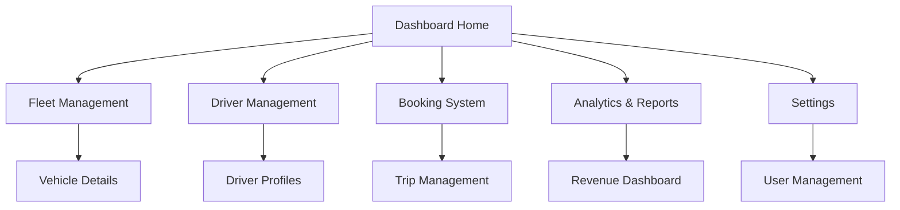

# Taxi Parks Dashboard - Product Requirements Document

## 1. Product Overview
A comprehensive web-based dashboard for managing taxi park operations, providing real-time insights into fleet management, driver performance, and operational analytics. The platform enables taxi park operators to efficiently monitor vehicle status, track driver activities, manage bookings, and analyze business performance through intuitive data visualizations.

## 2. Core Features

### 2.1 User Roles
| Role | Registration Method | Core Permissions |
|------|---------------------|------------------|
| Admin | System invitation | Full access to all features, user management, system configuration |
| Park Manager | Admin invitation | Manage drivers, vehicles, view reports, operational oversight |
| Dispatcher | Manager invitation | Manage bookings, assign drivers, track vehicles |
| Driver | Registration with park code | View personal dashboard, update status, receive assignments |

### 2.2 Feature Module
Our taxi parks dashboard consists of the following main pages:
1. **Dashboard Home**: Overview metrics, real-time status indicators, quick action buttons, recent activity feed.
2. **Fleet Management**: Vehicle list, vehicle details, maintenance tracking, availability status.
3. **Driver Management**: Driver profiles, performance metrics, shift scheduling, document management.
4. **Booking System**: Trip requests, assignment interface, booking history, customer management.
5. **Analytics & Reports**: Revenue analytics, performance dashboards, operational reports, data exports.
6. **Settings**: User management, system configuration, notification preferences, park settings.

### 2.3 Page Details
| Page Name | Module Name | Feature description |
|-----------|-------------|---------------------|
| Dashboard Home | Overview Metrics | Display key performance indicators: active vehicles, available drivers, daily revenue, completed trips |
| Dashboard Home | Real-time Status | Show live vehicle locations on map, driver status indicators, current bookings |
| Dashboard Home | Quick Actions | Provide shortcuts for common tasks: add new booking, assign driver, view alerts |
| Dashboard Home | Activity Feed | List recent activities: new bookings, completed trips, driver check-ins, system alerts |
| Fleet Management | Vehicle List | Display all vehicles with status, location, driver assignment, maintenance due dates |
| Fleet Management | Vehicle Details | Show comprehensive vehicle information: specifications, documents, maintenance history, performance metrics |
| Fleet Management | Maintenance Tracking | Track service schedules, repair history, cost tracking, reminder notifications |
| Driver Management | Driver Profiles | Manage driver information: personal details, license verification, contact information, employment history |
| Driver Management | Performance Metrics | Track driver statistics: trips completed, ratings, earnings, efficiency scores |
| Driver Management | Shift Management | Schedule driver shifts, track working hours, manage availability, overtime calculations |
| Booking System | Trip Management | Create, edit, cancel bookings; assign drivers; track trip progress; handle customer requests |
| Booking System | Assignment Interface | Intelligent driver assignment based on location, availability, performance ratings |
| Booking System | Customer Management | Maintain customer database, booking history, preferences, feedback management |
| Analytics & Reports | Revenue Dashboard | Visualize daily, weekly, monthly revenue trends; profit margins; cost analysis |
| Analytics & Reports | Performance Analytics | Driver performance comparisons, vehicle utilization rates, operational efficiency metrics |
| Analytics & Reports | Custom Reports | Generate detailed reports for specific time periods, export data in various formats |
| Settings | User Management | Add, edit, remove users; assign roles; manage permissions; password resets |
| Settings | System Configuration | Configure park settings, pricing rules, notification preferences, integration settings |

## 3. Core Process

**Admin/Manager Flow:**
1. Login to dashboard and view overview metrics
2. Monitor real-time vehicle and driver status
3. Manage bookings and assign drivers
4. Review performance analytics and generate reports
5. Configure system settings and manage users

**Dispatcher Flow:**
1. Access booking management interface
2. Receive and process trip requests
3. Assign available drivers based on location and status
4. Monitor trip progress and handle customer communications
5. Update booking status and handle payments

**Driver Flow:**
1. Login to mobile-optimized dashboard
2. Update availability status and location
3. Receive trip assignments and notifications
4. Update trip status and complete bookings
5. View earnings and performance metrics

## 4. User Interface Design

### 4.1 Design Style
- **Primary Colors**: Deep blue (#1E40AF) for headers and primary actions, light blue (#3B82F6) for accents
- **Secondary Colors**: Gray (#6B7280) for text, green (#10B981) for success states, red (#EF4444) for alerts
- **Button Style**: Rounded corners (8px radius), subtle shadows, hover effects with color transitions
- **Font**: Inter or similar modern sans-serif, 14px base size, 16px for headings, 12px for captions
- **Layout Style**: Card-based design with clean spacing, top navigation bar, sidebar for main sections
- **Icons**: Outline style icons (Heroicons or similar), consistent 20px size for navigation, 16px for inline elements

### 4.2 Page Design Overview
| Page Name | Module Name | UI Elements |
|-----------|-------------|-------------|
| Dashboard Home | Overview Metrics | Grid layout with metric cards, large numbers with trend indicators, color-coded status badges |
| Dashboard Home | Real-time Map | Interactive map component with vehicle markers, driver status indicators, zoom controls |
| Dashboard Home | Activity Feed | Scrollable list with timestamps, action icons, expandable details, real-time updates |
| Fleet Management | Vehicle Grid | Responsive card layout, vehicle images, status badges, quick action buttons |
| Driver Management | Driver Table | Sortable data table with profile photos, status indicators, performance ratings |
| Booking System | Trip Interface | Split-pane layout with trip list and details panel, drag-and-drop assignment |
| Analytics & Reports | Charts Dashboard | Interactive charts using Chart.js or similar, date range selectors, export buttons |
| Settings | Configuration Forms | Tabbed interface with form sections, toggle switches, validation feedback |

### 4.3 Responsiveness
Desktop-first design with mobile-adaptive breakpoints at 768px and 1024px. Touch-optimized interactions for mobile devices with larger tap targets (44px minimum) and swipe gestures for navigation. Sidebar collapses to hamburger menu on mobile, cards stack vertically, and tables become horizontally scrollable.