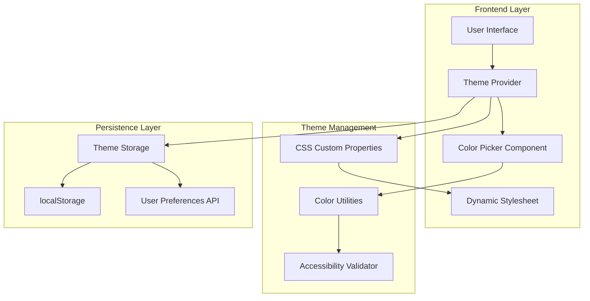

# Theme Color Customization Technical Architecture

## 1. Architecture Design



## 2. Technology Description

* Frontend: React\@18 + TypeScript + CSS Custom Properties

* Color Picker: react-colorful + tinycolor2 for color manipulation

* Accessibility: polished library for contrast calculations

* Storage: localStorage + backend API for user preferences

* CSS: Tailwind CSS with custom property integration

## 3. Implementation Strategy

### 3.1 CSS Custom Properties System

**Root CSS Variables**

```css
/* src/styles/theme.css */
:root {
  /* Primary Color Palette */
  --color-primary: 59 130 246; /* RGB values for Tailwind compatibility */
  --color-primary-50: 239 246 255;
  --color-primary-100: 219 234 254;
  --color-primary-200: 191 219 254;
  --color-primary-300: 147 197 253;
  --color-primary-400: 96 165 250;
  --color-primary-500: 59 130 246; /* Base primary */
  --color-primary-600: 37 99 235;
  --color-primary-700: 29 78 216;
  --color-primary-800: 30 64 175;
  --color-primary-900: 30 58 138;
  
  /* Semantic Color Mappings */
  --color-button-primary: var(--color-primary-500);
  --color-button-primary-hover: var(--color-primary-600);
  --color-link: var(--color-primary-600);
  --color-link-hover: var(--color-primary-700);
  --color-border-focus: var(--color-primary-500);
  
  /* Accessibility */
  --color-focus-ring: var(--color-primary-500);
  --color-selection: var(--color-primary-100);
}

/* Dark mode overrides */
@media (prefers-color-scheme: dark) {
  :root {
    --color-primary-50: 30 58 138;
    --color-primary-100: 30 64 175;
    /* ... inverted scale for dark mode */
  }
}
```

**Tailwind CSS Integration**

```javascript
// tailwind.config.js
module.exports = {
  content: ['./src/**/*.{js,jsx,ts,tsx}'],
  theme: {
    extend: {
      colors: {
        primary: {
          50: 'rgb(var(--color-primary-50) / <alpha-value>)',
          100: 'rgb(var(--color-primary-100) / <alpha-value>)',
          200: 'rgb(var(--color-primary-200) / <alpha-value>)',
          300: 'rgb(var(--color-primary-300) / <alpha-value>)',
          400: 'rgb(var(--color-primary-400) / <alpha-value>)',
          500: 'rgb(var(--color-primary-500) / <alpha-value>)',
          600: 'rgb(var(--color-primary-600) / <alpha-value>)',
          700: 'rgb(var(--color-primary-700) / <alpha-value>)',
          800: 'rgb(var(--color-primary-800) / <alpha-value>)',
          900: 'rgb(var(--color-primary-900) / <alpha-value>)',
        }
      }
    }
  },
  plugins: []
};
```

### 3.2 Theme Provider Implementation

```typescript
// src/contexts/ThemeContext.tsx
import React, { createContext, useContext, useState, useEffect } from 'react';
import { generateColorPalette, validateAccessibility } from '../utils/colorUtils';

interface ThemeContextType {
  primaryColor: string;
  setPrimaryColor: (color: string) => void;
  presets: ColorPreset[];
  currentPreset: string | null;
  applyPreset: (presetId: string) => void;
  saveCustomPreset: (name: string, color: string) => void;
  resetToDefault: () => void;
  accessibilityScore: AccessibilityScore;
}

interface ColorPreset {
  id: string;
  name: string;
  primaryColor: string;
  isCustom: boolean;
}

interface AccessibilityScore {
  contrastRatio: number;
  wcagAA: boolean;
  wcagAAA: boolean;
  colorBlindSafe: boolean;
}

const DEFAULT_COLOR = '#3B82F6';
const STORAGE_KEY = 'theme-preferences';

const ThemeContext = createContext<ThemeContextType | undefined>(undefined);

export const useTheme = () => {
  const context = useContext(ThemeContext);
  if (!context) {
    throw new Error('useTheme must be used within ThemeProvider');
  }
  return context;
};

export const ThemeProvider: React.FC<{ children: React.ReactNode }> = ({ children }) => {
  const [primaryColor, setPrimaryColorState] = useState(DEFAULT_COLOR);
  const [currentPreset, setCurrentPreset] = useState<string | null>(null);
  const [accessibilityScore, setAccessibilityScore] = useState<AccessibilityScore>({
    contrastRatio: 4.5,
    wcagAA: true,
    wcagAAA: false,
    colorBlindSafe: true
  });

  const presets: ColorPreset[] = [
    { id: 'ocean-blue', name: 'Ocean Blue', primaryColor: '#3B82F6', isCustom: false },
    { id: 'forest-green', name: 'Forest Green', primaryColor: '#059669', isCustom: false },
    { id: 'sunset-orange', name: 'Sunset Orange', primaryColor: '#EA580C', isCustom: false },
    { id: 'royal-purple', name: 'Royal Purple', primaryColor: '#7C3AED', isCustom: false },
    { id: 'cherry-red', name: 'Cherry Red', primaryColor: '#DC2626', isCustom: false },
  ];

  const setPrimaryColor = (color: string) => {
    setPrimaryColorState(color);
    applyColorToCSS(color);
    validateAndSetAccessibility(color);
    saveToStorage({ primaryColor: color, preset: null });
    setCurrentPreset(null);
  };

  const applyColorToCSS = (color: string) => {
    const palette = generateColorPalette(color);
    const root = document.documentElement;
    
    Object.entries(palette).forEach(([shade, rgb]) => {
      root.style.setProperty(`--color-primary-${shade}`, rgb);
    });
  };

  const validateAndSetAccessibility = (color: string) => {
    const score = validateAccessibility(color);
    setAccessibilityScore(score);
  };

  const applyPreset = (presetId: string) => {
    const preset = presets.find(p => p.id === presetId);
    if (preset) {
      setPrimaryColor(preset.primaryColor);
      setCurrentPreset(presetId);
    }
  };

  const saveToStorage = (preferences: any) => {
    localStorage.setItem(STORAGE_KEY, JSON.stringify(preferences));
  };

  const loadFromStorage = () => {
    try {
      const stored = localStorage.getItem(STORAGE_KEY);
      if (stored) {
        const preferences = JSON.parse(stored);
        if (preferences.primaryColor) {
          setPrimaryColorState(preferences.primaryColor);
          applyColorToCSS(preferences.primaryColor);
          validateAndSetAccessibility(preferences.primaryColor);
        }
        if (preferences.preset) {
          setCurrentPreset(preferences.preset);
        }
      }
    } catch (error) {
      console.error('Failed to load theme preferences:', error);
    }
  };

  useEffect(() => {
    loadFromStorage();
  }, []);

  const contextValue: ThemeContextType = {
    primaryColor,
    setPrimaryColor,
    presets,
    currentPreset,
    applyPreset,
    saveCustomPreset: () => {}, // Implementation needed
    resetToDefault: () => setPrimaryColor(DEFAULT_COLOR),
    accessibilityScore
  };

  return (
    <ThemeContext.Provider value={contextValue}>
      {children}
    </ThemeContext.Provider>
  );
};
```

### 3.3 Color Utilities

```typescript
// src/utils/colorUtils.ts
import { TinyColor } from '@ctrl/tinycolor';

export interface ColorPalette {
  50: string;
  100: string;
  200: string;
  300: string;
  400: string;
  500: string;
  600: string;
  700: string;
  800: string;
  900: string;
}

export const generateColorPalette = (baseColor: string): ColorPalette => {
  const color = new TinyColor(baseColor);
  
  return {
    50: color.lighten(45).toRgbString().match(/\d+/g)!.join(' '),
    100: color.lighten(35).toRgbString().match(/\d+/g)!.join(' '),
    200: color.lighten(25).toRgbString().match(/\d+/g)!.join(' '),
    300: color.lighten(15).toRgbString().match(/\d+/g)!.join(' '),
    400: color.lighten(5).toRgbString().match(/\d+/g)!.join(' '),
    500: color.toRgbString().match(/\d+/g)!.join(' '), // Base color
    600: color.darken(5).toRgbString().match(/\d+/g)!.join(' '),
    700: color.darken(15).toRgbString().match(/\d+/g)!.join(' '),
    800: color.darken(25).toRgbString().match(/\d+/g)!.join(' '),
    900: color.darken(35).toRgbString().match(/\d+/g)!.join(' '),
  };
};

export const validateAccessibility = (color: string) => {
  const primaryColor = new TinyColor(color);
  const whiteContrast = primaryColor.contrast('#ffffff');
  const blackContrast = primaryColor.contrast('#000000');
  
  const bestContrast = Math.max(whiteContrast, blackContrast);
  
  return {
    contrastRatio: Math.round(bestContrast * 100) / 100,
    wcagAA: bestContrast >= 4.5,
    wcagAAA: bestContrast >= 7,
    colorBlindSafe: checkColorBlindSafety(color)
  };
};

const checkColorBlindSafety = (color: string): boolean => {
  // Simplified color blind safety check
  const tinyColor = new TinyColor(color);
  const hsl = tinyColor.toHsl();
  
  // Avoid problematic red-green combinations
  const isProblematicRedGreen = (
    (hsl.h >= 0 && hsl.h <= 30) || // Red range
    (hsl.h >= 90 && hsl.h <= 150)   // Green range
  ) && hsl.s > 0.7;
  
  return !isProblematicRedGreen;
};

export const hexToRgb = (hex: string): string => {
  const color = new TinyColor(hex);
  const rgb = color.toRgb();
  return `${rgb.r} ${rgb.g} ${rgb.b}`;
};

export const rgbToHex = (rgb: string): string => {
  const [r, g, b] = rgb.split(' ').map(Number);
  return new TinyColor({ r, g, b }).toHexString();
};
```

### 3.4 Color Picker Component

```typescript
// src/components/ColorPicker.tsx
import React, { useState } from 'react';
import { HexColorPicker } from 'react-colorful';
import { useTheme } from '../contexts/ThemeContext';
import { Palette, Check, AlertTriangle } from 'lucide-react';

export const ColorPicker: React.FC = () => {
  const { 
    primaryColor, 
    setPrimaryColor, 
    presets, 
    currentPreset, 
    applyPreset,
    accessibilityScore 
  } = useTheme();
  
  const [tempColor, setTempColor] = useState(primaryColor);
  const [showAdvanced, setShowAdvanced] = useState(false);

  const handleColorChange = (color: string) => {
    setTempColor(color);
  };

  const applyColor = () => {
    setPrimaryColor(tempColor);
  };

  const resetColor = () => {
    setTempColor(primaryColor);
  };

  return (
    <div className="space-y-6">
      {/* Header */}
      <div className="flex items-center justify-between">
        <h3 className="text-lg font-semibold flex items-center gap-2">
          <Palette className="h-5 w-5" />
          Theme Colors
        </h3>
        <button
          onClick={() => setShowAdvanced(!showAdvanced)}
          className="text-sm text-gray-600 hover:text-gray-800"
        >
          {showAdvanced ? 'Simple' : 'Advanced'}
        </button>
      </div>

      {/* Color Presets */}
      <div>
        <h4 className="text-sm font-medium text-gray-700 mb-3">Color Presets</h4>
        <div className="grid grid-cols-5 gap-2">
          {presets.map((preset) => (
            <button
              key={preset.id}
              onClick={() => applyPreset(preset.id)}
              className={`
                relative w-12 h-12 rounded-lg border-2 transition-all
                ${currentPreset === preset.id 
                  ? 'border-gray-400 scale-110' 
                  : 'border-gray-200 hover:border-gray-300'
                }
              `}
              style={{ backgroundColor: preset.primaryColor }}
              title={preset.name}
            >
              {currentPreset === preset.id && (
                <Check className="absolute inset-0 m-auto h-4 w-4 text-white" />
              )}
            </button>
          ))}
        </div>
      </div>

      {/* Color Picker */}
      <div>
        <h4 className="text-sm font-medium text-gray-700 mb-3">Custom Color</h4>
        <div className="space-y-4">
          <HexColorPicker color={tempColor} onChange={handleColorChange} />
          
          {/* Hex Input */}
          <div className="flex items-center gap-2">
            <input
              type="text"
              value={tempColor}
              onChange={(e) => setTempColor(e.target.value)}
              className="flex-1 px-3 py-2 border border-gray-300 rounded-md text-sm"
              placeholder="#3B82F6"
            />
            <div 
              className="w-10 h-10 rounded border border-gray-300"
              style={{ backgroundColor: tempColor }}
            />
          </div>

          {/* Action Buttons */}
          <div className="flex gap-2">
            <button
              onClick={applyColor}
              className="flex-1 bg-primary-600 text-white px-4 py-2 rounded-md hover:bg-primary-700 transition-colors"
            >
              Apply Color
            </button>
            <button
              onClick={resetColor}
              className="px-4 py-2 border border-gray-300 rounded-md hover:bg-gray-50 transition-colors"
            >
              Reset
            </button>
          </div>
        </div>
      </div>

      {/* Accessibility Score */}
      <div className="bg-gray-50 p-4 rounded-lg">
        <h4 className="text-sm font-medium text-gray-700 mb-2 flex items-center gap-2">
          {accessibilityScore.wcagAA ? (
            <Check className="h-4 w-4 text-green-600" />
          ) : (
            <AlertTriangle className="h-4 w-4 text-yellow-600" />
          )}
          Accessibility Score
        </h4>
        <div className="space-y-1 text-sm">
          <div className="flex justify-between">
            <span>Contrast Ratio:</span>
            <span className="font-medium">{accessibilityScore.contrastRatio}:1</span>
          </div>
          <div className="flex justify-between">
            <span>WCAG AA:</span>
            <span className={accessibilityScore.wcagAA ? 'text-green-600' : 'text-red-600'}>
              {accessibilityScore.wcagAA ? 'Pass' : 'Fail'}
            </span>
          </div>
          <div className="flex justify-between">
            <span>WCAG AAA:</span>
            <span className={accessibilityScore.wcagAAA ? 'text-green-600' : 'text-red-600'}>
              {accessibilityScore.wcagAAA ? 'Pass' : 'Fail'}
            </span>
          </div>
          <div className="flex justify-between">
            <span>Color Blind Safe:</span>
            <span className={accessibilityScore.colorBlindSafe ? 'text-green-600' : 'text-yellow-600'}>
              {accessibilityScore.colorBlindSafe ? 'Yes' : 'Caution'}
            </span>
          </div>
        </div>
      </div>
    </div>
  );
};
```

## 4. Integration with Settings Page

```typescript
// Add to Settings.tsx
import { ColorPicker } from '../components/ColorPicker';

// Add new tab for Theme
const tabs = [
  { id: 'general', name: 'General', icon: Settings },
  { id: 'notifications', name: 'Notifications', icon: Bell },
  { id: 'pricing', name: 'Pricing', icon: DollarSign },
  { id: 'users', name: 'Users', icon: Users },
  { id: 'theme', name: 'Theme', icon: Palette }, // New theme tab
  { id: 'security', name: 'Security', icon: Shield },
];

// Add theme tab content
{activeTab === 'theme' && (
  <div className="space-y-6">
    <div>
      <h2 className="text-xl font-semibold text-gray-900 mb-2">Theme Customization</h2>
      <p className="text-gray-600">Customize the appearance of your dashboard with your preferred colors.</p>
    </div>
    <ColorPicker />
  </div>
)}
```

## 5. Performance Considerations

* **CSS Custom Properties**: Minimal runtime overhead for color changes

* **Debounced Updates**: Prevent excessive re-renders during color picking

* **Lazy Loading**: Load color picker components only when needed

* **Memoization**: Cache color calculations and accessibility validations

* **Storage Optimization**: Compress theme data in localStorage

